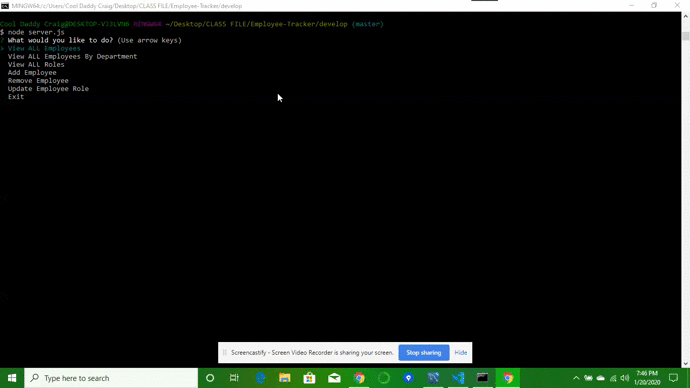

# Employee-Tracker
MySQL Example

This Application takes three seperate MySQL tables and joins them together to make one single tbale with all information displayed for a companies employee chart. In the console as show below with the GIF one can view and add/delete employees in the application without having to be in MySQL.

An example of the output is show below.

